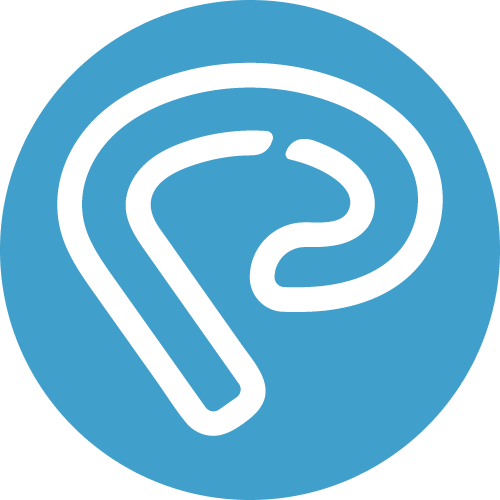
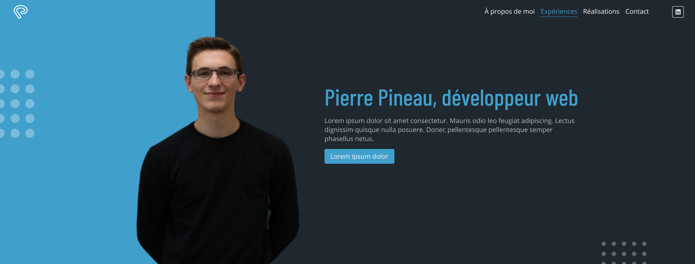
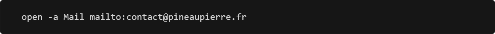

<!--  -->
<center>
  
</center>

# Bonjour, je m'appelle Pierre Pineau ! 👋


## 🚀 À propos de moi
Je suis développeur fullstack


## 🛠 Skills
Javascript, HTML, CSS...


## Mon portfolio
[](https://pineaupierre.fr/)


## 🔗 Me contacter
[](https://www.linkedin.com/in/pierre-pineau-pro/)

Ou alors lancer la commande suivante
<!-- Une commande pour ouvrir son application mail ? -->
<a href="mailto:contact@pineaupierre.fr">
   
</a>

<!-- 
```bash
  open -a Mail mailto:contact@pineaupierre.fr
``` -->


## Spécialités
👩‍💻 I'm currently working on...

🧠 I'm currently learning...

👯‍♀️ I'm looking to collaborate on...

🤔 I'm looking for help with...

💬 Ask me about...

📫 How to reach me...

😄 Pronouns...

⚡️ Fun fact...


## License

[MIT](https://choosealicense.com/licenses/mit/)


## Lessons Learned

What did you learn while building this project? What challenges did you face and how did you overcome them?


## Badges

Add badges from somewhere like: [shields.io](https://shields.io/)

[](https://choosealicense.com/licenses/mit/)
[](https://opensource.org/licenses/)
[](http://www.gnu.org/licenses/agpl-3.0)

